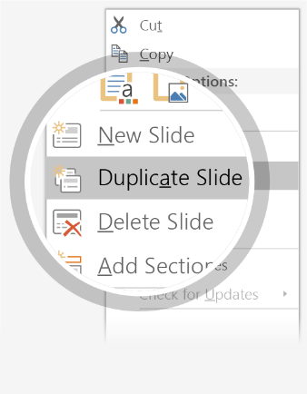

---  
# 1 #
---  
Welcome to PowerPoint  
# 5 tips for a simpler way to work #  
  

---  
# 2 #
---  
Designer helps you get your point across  
  
PowerPoint Designer suggests professional designs for your presentation\, based on the content in your slides\.   
Designer is a subscription\-only feature\. If you have an Office 365 subscription\, the next slide shows you how it works in a new presentation\.  

---  
# 3 #
---  
How to use PowerPoint Designer  
How it works\:  
  
  
1  
Start a new presentation by going to File \> New \> Blank Presentation\.  
  
2  
On the very first slide\, add a picture\: Go to Insert \> Pictures or Insert \> Online Pictures and choose the picture\.

Hint\: You need to be online when you add the picture\.  
  
  
3  
When PowerPoint asks your permission to get design ideas\, select Let\'s Go\.  
  
4  
Choose a design you like from the Design Ideas task pane\.  

---  
# 4 #
---  
Morph  
Morph makes smooth animations and object movements in your presentation\. You use two similar slides to perform the animation\, but it looks to your audience like the action happens on one slide\.   
**Play** the video on the right to see a quick example\.  
Morph is a subscription\-only feature\. If you have an Office 365 subscription\, you can try it yourself with the steps on the next slide\.  

  

---  
# 5 #
---  
Setting up Morph  
  
Try it yourself with these two simple “planets”\:  
  
  
1  
  
Duplicate this slide\: Right\-click the slide thumbnail and select Duplicate Slide\.  
  
  
2  
In the second of these two identical slides\, change the shapes on the right in some way \(move\, resize\, change color\)\, then go to Transitions \> Morph\.  
  
  
3  
  
Return to the first of the two slides and press Slide Show button and then select Play to see your circle morph\!  
Hint\: Effect Options gives you even more options for Morph\.  

---  
# 6 #
---  
Working together in real time  
When you share your presentation with others\, you’ll see them working with you at the same time\. 

How it works\:  
  
  
  
  
1  
  
2  
  
3  
Select Share from above the ribbon\, or by using short\-key Alt\-ZS\, to invite people to work with you \(You can save to the cloud at this point\.\)  
When other people are in the presentation\, a marker shows who is on which slide…  
…and the part of the slide they\'re editing\.  

---  
# 7 #
---  
You’re an expert with Tell Me  
The Tell Me box finds the right command when you need it\, 
so you can save time and focus on your work\.

Try it\:  
  
**SELECT ME**  
  
  
1  
Select the Robot picture on the right\.  
  
2  
Type *animation* in the Tell Me box\, and then choose Add Animation\.  
  
  
  
3  
Choose an animation effect\, like Zoom\, and watch 
what happens\.  

---  
# 8 #
---  
Explore without leaving your slides  
Smart Lookup brings research directly in to PowerPoint\.

Try it\:  
  
  
1  
  
2  
  
3  
Right\-click in the word *office* in the following phrase\: office furniture  
Choose Smart Lookup\, and notice that results are contextual for that phrase\, not Microsoft Office apps\.  
Just for fun\, try Smart Lookup again by right\-clicking in the word *Office* in Step 2\.  

---  
# 9 #
---  
More questions about PowerPoint\?  
  
Select the Tell Me button and type what you want to know\.
  
[Visit the PowerPoint team blog](http://go.microsoft.com/fwlink/?LinkId=617172)  
[Go to free PowerPoint training](http://go.microsoft.com/fwlink/?LinkId=623327)  
[Give feedback about this tour](https://go.microsoft.com/fwlink/?linkid=854609)  

  
  
  
  
SELECT THE ARROW WHEN IN SLIDE SHOW MODE  
